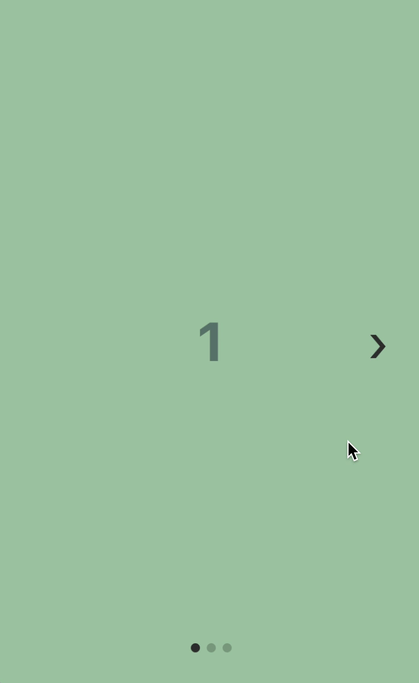

<h1 align="center" style="font-size: 1.12rem;"></h1>

<p align="center" style="font-size: 1.12rem;">Customizable, lightweight React Native carousel component with accessibility support.</p>

<hr />

 [](https://www.npmjs.com/package/pinar) [](https://github.com/kristerkari/pinar/actions?workflow=Tests)   [](http://npmcharts.com/compare/pinar?periodLength=30) [](https://egghead.io/courses/how-to-contribute-to-an-open-source-project-on-github)

Pinar is a lightweight and customizable React Native carousel component that works well when creating simple image sliders or app onboarding flows.

If you need more advanced things like animations, lazy loading of images, or parallax, then please consider using a library like [`react-native-reanimated-carousel`](https://github.com/dohooo/react-native-reanimated-carousel).

## Table of contents

- [Install](#install)
- [Basic example](#basic-example)
- [More examples](#more-examples)
- [Properties](#properties)
  - [Basic carousel properties](#basic-carousel-properties)
  - [Callbacks](#callbacks)
  - [Methods](#methods)
  - [Custom styling properties](#custom-styling-properties)
  - [Custom render properties](#custom-render-properties)
  - [Properties of `<ScrollView />`](#properties-of-scrollview)
- [Dependencies](#dependencies)
- [Development](#development)
- [Automated tests](#automated-tests)
- [Special thanks](#special-thanks)
- [License](#license)

### Install

```sh
yarn add pinar --save

## or
## npm install pinar --save
```

### Basic example

```jsx
import React from "react";
import { Text, View } from "react-native";
import Carousel from "pinar";

const styles = {
  slide1: {
    flex: 1,
    justifyContent: "center",
    alignItems: "center",
    backgroundColor: "#a3c9a8"
  },
  slide2: {
    flex: 1,
    justifyContent: "center",
    alignItems: "center",
    backgroundColor: "#84b59f"
  },
  slide3: {
    flex: 1,
    justifyContent: "center",
    alignItems: "center",
    backgroundColor: "#69a297"
  },
  text: {
    color: "#1f2d3d",
    opacity: 0.7,
    fontSize: 48,
    fontWeight: "bold"
  }
};

export default () => (
  <Carousel>
    <View style={styles.slide1}>
      <Text style={styles.text}>1</Text>
    </View>
    <View style={styles.slide2}>
      <Text style={styles.text}>2</Text>
    </View>
    <View style={styles.slide3}>
      <Text style={styles.text}>3</Text>
    </View>
  </Carousel>
);
```

**Result:**



### More examples

The [`/examples` folder](/examples) has a React Native app that you can run on your machine to see the carousel being used with a lot of different options.

If you don't want to run the app, you can have a look at the [components folder](/examples/components) for example components.

### Properties

#### Basic carousel properties

| Property                 | Default  |   Type    | Description                                                               |
| :----------------------- | :------: | :-------: | :------------------------------------------------------------------------ |
| `horizontal`             |   true   | `boolean` | Set to `false` for a vertical carousel.                                   |
| `loop`                   |  false   | `boolean` | Set to `true` to enable continuous loop mode.                             |
| `index`                  |    0     | `number`  | Index number of initial slide.                                            |
| `showsControls`          |   true   | `boolean` | Set to `false` to hide prev/next buttons.                                 |
| `showsDots`              |   true   | `boolean` | Set to `false` to hide pagination dots.                                   |
| `autoplay`               |  false   | `boolean` | Set to `true` enable autoplay mode.                                       |
| `autoplayInterval`       |   3000   | `number`  | Delay between autoplay page changes (in milliseconds).                    |
| `width`                  |    -     | `number`  | If not specified, the default fullscreen mode is enabled using `flex: 1`. |
| `height`                 |    -     | `number`  | If not specified, the default fullscreen mode is enabled using `flex: 1`. |
| `accessibility`          |   true   | `boolean` | Set to `false` to disable accessibility features (not recommended).       |
| `accessibilityLabelPrev` | Previous | `string`  | Accessibility label for the prev button.                                  |
| `accessibilityLabelNext` |   Next   | `string`  | Accessibility label for the next button.                                  |
| `mergeStyles`            |   false  | `boolean` | Set to `true` to merge your custom styles with the default styles.        |

#### Callbacks

Use these properties to be notified when the user scrolls the carousel or changes the page.

| Property              |         Parameters         |    Type    | Description                                                       |
| :-------------------- | :------------------------: | :--------: | :---------------------------------------------------------------- |
| `onIndexChanged`      | ({ index, total }) => void | `function` | Called with the new page index when the user changes a page.      |
| `onLayout`            |      (event) => void       | `function` | Called when layout changes for the main `<View>` wrapper element. |
| `onScroll`            |      (event) => void       | `function` | Called when `<ScrollView>` is scrolled.                           |
| `onMomentumScrollEnd` |      (event) => void       | `function` | Called when `<ScrollView>`'s momentum scroll finishes.            |

#### Methods

To use methods you need to get a reference to the carousel inside your React class component.

```jsx
<Carousel
  ref={carousel => {
    this.carousel = carousel;
  }}
/>
```

You can then call the method from outside the carousel:

```jsx
<Button
  title="scroll to next page"
  onPress={() => {
    this.carousel.scrollToNext();
  }}
/>
```

| Method          |               Arguments                |    Type    | Description                                                                  |
| :-------------- | :------------------------------------: | :--------: | :--------------------------------------------------------------------------- |
| `scrollToPrev`  |                  None                  | `function` | Scroll to the previous page.                                                 |
| `scrollToNext`  |                  None                  | `function` | Scroll to the next page.                                                     |
| `scrollBy`      | {`index: number`, `animated: boolean`} | `function` | Scroll by a number of pages. The number can be negative to scroll backwards. |
| `scrollToIndex` | {`index: number`, `animated: boolean`} | `function` | Scroll to a page index (0 based).                                            |
| `startAutoplay` |                  None                  | `function` | Starts carousel autoplay.                                                    |
| `stopAutoplay`  |                  None                  | `function` | Stops carousel autoplay.                                                     |

#### Custom styling properties

Use these properties to customize how the carousel is styled.

Set the `mergeStyles` property to `true` if you want to merge your custom styles with the default ones instead of having define all the needed styles. You can also `import { defaulStyles } from "pinar"` to get access to the default styles and use them as defaults.

Have a look at the ["custom styles" component](/examples/components/CustomStyles.tsx) and ["custom styles with merge" component](/examples/components/CustomMergeStyles.tsx) for an example.

| Property                 | Default |          Type          | Description                                       |
| :----------------------- | :-----: | :--------------------: | :------------------------------------------------ |
| `style`                  |  {...}  | `StyleProp<ViewStyle>` | See default style in the source code.             |
| **ScrollView**           |         |                        |                                                   |  |
| `containerStyle`         |  {...}  | `StyleProp<ViewStyle>` | See default style in the source code.             |
| `contentContainerStyle`  |  {...}  | `StyleProp<ViewStyle>` | See default container style in the source code.   |
| **Prev/Next buttons**    |         |                        |                                                   |  |
| `controlsContainerStyle` |  {...}  | `StyleProp<ViewStyle>` | Custom style for the prev/next buttons container. |
| `controlsButtonStyle`    |  {...}  | `StyleProp<ViewStyle>` | Custom style for the prev/next button.            |
| `controlsTextStyle`      |  {...}  | `StyleProp<TextStyle>` | Custom style for the prev/next button text.       |
| **Pagination dots**      |         |                        |                                                   |
| `dotsContainerStyle`     |  {...}  | `StyleProp<ViewStyle>` | Custom style for the pagination dots container.   |
| `dotStyle`               |  {...}  | `StyleProp<ViewStyle>` | Custom style for a single pagination dot.         |
| `activeDotStyle`         |  {...}  | `StyleProp<ViewStyle>` | Custom style for the active pagination dot.       |

#### Custom render properties

Use these properties to provide your own functions render custom elements instead of the default ones. Have a look at [the custom rendering component](/examples/components/CustomRender.tsx) for an example.

| Property              |           Function parameters            |    Type    | Description                              |
| :-------------------- | :--------------------------------------: | :--------: | :--------------------------------------- |
| **Pagination dots**   |                                          |            |                                          |
| `renderDots`          |   ({ index, total, context }) => void    | `function` | Use to render custom pagination dots.    |
| `renderDot`           |           ({ index }) => void            | `function` | Use to render custom dot (not active).   |
| `renderActiveDot`     |           ({ index }) => void            | `function` | Use to render custom active dot.         |
| **Prev/Next buttons** |                                          |            |                                          |
| `renderControls`      | ({ scrollToPrev, scrollToNext }) => void | `function` | Use to render custom prev/next controls. |
| `renderPrev`          |        ({ scrollToPrev }) => void        | `function` | Use to render custom prev control.       |
| `renderNext`          |        ({ scrollToNext }) => void        | `function` | Use to render custom next control.       |

#### Properties of `<ScrollView />`

These properties are exposed from `<ScrollView />`. You can provide your own properties if you want to customize it.

| Property                           |   Default   |          Type          | Description                                                                                                                                                                                                                                                                                                                                                                                                                                                                                                                                                  |
| :--------------------------------- | :---------: | :--------------------: | :----------------------------------------------------------------------------------------------------------------------------------------------------------------------------------------------------------------------------------------------------------------------------------------------------------------------------------------------------------------------------------------------------------------------------------------------------------------------------------------------------------------------------------------------------------- |
| `automaticallyAdjustContentInsets` |   `false`   |         `bool`         | Controls whether iOS should automatically adjust the content inset for scroll views that are placed behind a navigation bar or tab bar/ toolbar.                                                                                                                                                                                                                                                                                                                                                                                                             |
| `bounces`                          |   `false`   |         `bool`         | If `true`, the scroll view bounces when it reaches the end of the content if the content is larger then the scroll view along the axis of the scroll direction. If `false`, it disables all bouncing even if the alwaysBounce\* props are true.                                                                                                                                                                                                                                                                                                              |
| `contentContainerStyle`            | `undefined` | `StyleProp<ViewStyle>` | These styles will be applied to the scroll view content container which wraps all of the child views.                                                                                                                                                                                                                                                                                                                                                                                                                                                        | horizontal | true | `bool` | When true, the scroll view's children are arranged horizontally in a row instead of vertically in a column. |  |
| `onMomentumScrollEnd`              | `undefined` |       `function`       | Called when the momentum scroll ends (scroll which occurs as the ScrollView glides to a stop).                                                                                                                                                                                                                                                                                                                                                                                                                                                               |
| `onScroll`                         | `undefined` |       `function`       | Fires at most once per frame during scrolling. The frequency of the events can be controlled using the scrollEventThrottle prop.                                                                                                                                                                                                                                                                                                                                                                                                                             |
| `pagingEnabled`                    |   `true`    |         `bool`         | When `true`, the scroll view stops on multiples of the scroll view's size when scrolling. This can be used for horizontal pagination.                                                                                                                                                                                                                                                                                                                                                                                                                        |
| `removeClippedSubviews`            |   `true`    |         `bool`         | When `true`, offscreen child views (whose overflow value is hidden) are removed from their native backing superview when offscreen. This can improve scrolling performance on long lists.                                                                                                                                                                                                                                                                                                                                                                    |
| `scrollEnabled`                    |   `true`    |         `bool`         | When `false`, the view cannot be scrolled via touch interaction.                                                                                                                                                                                                                                                                                                                                                                                                                                                                                             |
| `scrollEventThrottle`              |    `16`     |        `number`        | This controls how often the scroll event will be fired while scrolling (as a time interval in ms). A lower number yields better accuracy for code that is tracking the scroll position, but can lead to scroll performance problems due to the volume of information being send over the bridge. You will not notice a difference between values set between 1-16 as the JS run loop is synced to the screen refresh rate. If you do not need precise scroll position tracking, set this value higher to limit the information being sent across the bridge. |
| `scrollsToTop`                     |   `false`   |         `bool`         | When `true`, the scroll view scrolls to top when the status bar is tapped.                                                                                                                                                                                                                                                                                                                                                                                                                                                                                   |
| `showsHorizontalScrollIndicator`   |   `false`   |         `bool`         | When `true`, shows a horizontal scroll indicator. The default value is true.                                                                                                                                                                                                                                                                                                                                                                                                                                                                                 |
| `showsVerticalScrollIndicator`     |   `false`   |         `bool`         | When `true`, shows a vertical scroll indicator. The default value is true.                                                                                                                                                                                                                                                                                                                                                                                                                                                                                   |

> for more info: http://facebook.github.io/react-native/docs/scrollview.html

### Dependencies

No other dependencies than React Native.

### Development

If you want help out with the development of this library, bug reports and fixes are very welcome. If you are thinking about a new feature, please open a feature request issue first to verify that implementing it makes sense.

#### How to develop locally

First make sure that you have [Node.js](https://nodejs.org/), [Yarn](https://yarnpkg.com/) and [React Native](https://facebook.github.io/react-native/docs/getting-started.html) installed. It is also a good idea to have [Xcode](https://developer.apple.com/xcode/) and/or [Android Studio](https://developer.android.com/studio/) installed to be able to run the iOS simulators / Android emulators.

If you choose to install emulators or simulators, you can use [the example app](/examples) to test your changes in a React Native app.

#### Automated tests

When making changes to the code, please add a unit test or a functional test to verify that the code is working. The test runner that the project uses is [Jest](https://jestjs.io/), [Enzyme](https://airbnb.io/enzyme/) is used to test React Components, and [Detox](https://github.com/wix/Detox) is used to run functional tests against the project's example app. The command to run unit tests is `yarn test` and the command to run functional tests is `yarn functional`.

Before you submit the code for a Pull Request, make sure that you run `yarn test`, `yarn tsc`, and `yarn lint` to verify that unit tests pass and both the Typescript type checking and ESLint linting are not printing any errors.

### Special thanks

Special thanks for these libraries for providing inspiration for code and other things:

- [react-native-swiper](https://github.com/leecade/react-native-swiper) - Inspiration for the code and the library API.
- [react-native-snap-carousel](https://github.com/archriss/react-native-snap-carousel) - Inspiration for the library API and naming.
- [svgr](https://github.com/smooth-code/svgr) - Inspiration for the issue labels and issue templates.

---

### License

[MIT](/LICENSE)
